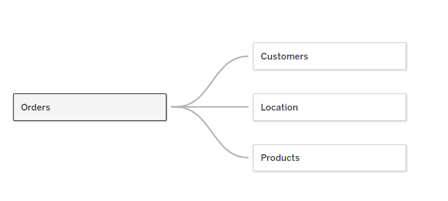

# SalesTrend Analysis - [dashboard](https://public.tableau.com/app/profile/udbhav.srivastava7988/viz/SalesDashboard_17112120980450/SalesDashboard?publish=yes)

Welcome to SalesTrend Analysis! This repository serves as a comprehensive resource for analyzing sales performance and customer insights in the retail sector. Using SQL queries and Tableau visualizations, we dive deep into sales data to uncover valuable trends and patterns that drive business growth.

## Objective

The objective of SalesTrend Analysis is to leverage data analytics to gain insights into sales performance, customer segmentation, and product profitability. Through meticulous analysis, we aim to provide actionable recommendations to optimize operations and enhance profitability in the retail industry.

## Schema 

  

These tables are interconnected using primary and foreign keys to establish relationships between them, allowing for efficient data retrieval and analysis across different dimensions such as orders, customers, products, and locations.

## Key Features

- **SQL Analysis:** Explore SQL queries crafted to extract meaningful insights from sales data.
- **Tableau Dashboards:** Interact with dynamic Tableau dashboards visualizing key metrics and trends.
- **Data-driven Insights:** Gain valuable insights into customer behavior, product performance, and regional sales trends.
- **Continuous Updates:** Stay tuned for regular updates as we uncover new insights and trends in sales data.

## Questions Explored

1. Yearly Sales Trend
2. Top Selling Products
3. Customer Segmentation
4. Average Order Value by Product Category
5. Profit Margin Analysis
6. City Wise Sales Performance
7. Discount Rates by Product Sub-Category
8. Cumulative Sales Analysis
9. Product Sales Ranking
10. Total Profit by Region

## Conclusion

By leveraging data analytics to analyze sales performance and customer insights, SalesTrend Analysis provides actionable recommendations to optimize strategies and drive business growth in the retail sector. Join us in exploring and uncovering valuable insights hidden in sales data!
